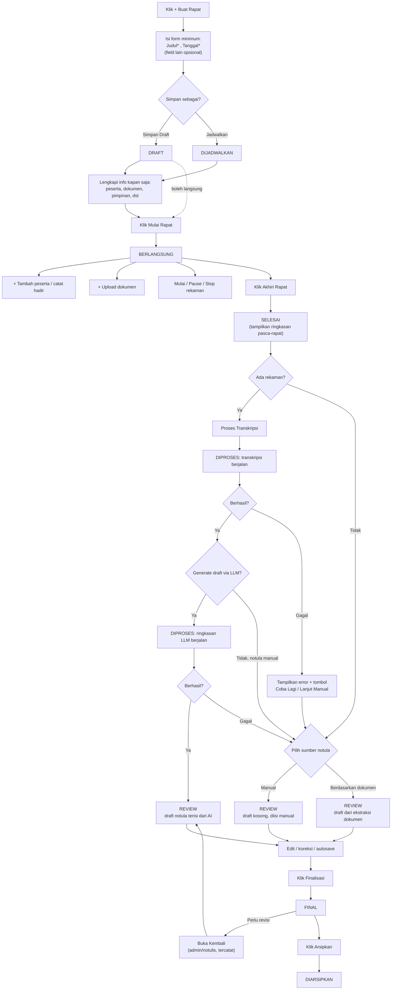
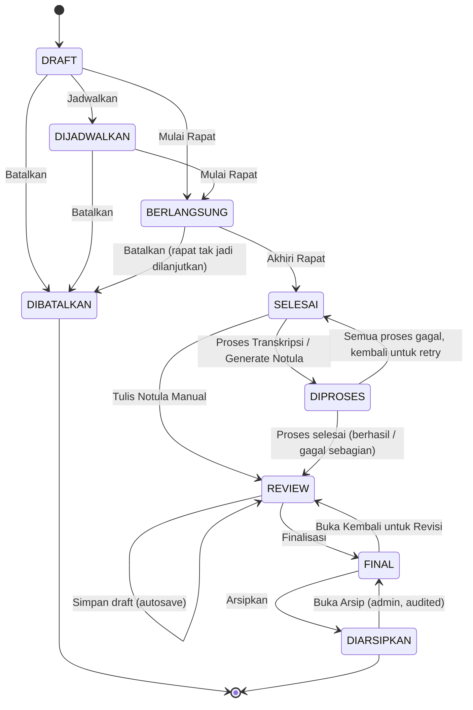

c# Rancangan Alur Rapat, Navigasi, State Machine & UX — NOTASI v2

**Status dokumen:** Draft rancangan (belum diimplementasikan)
**Prinsip dasar:** Data rapat bersifat *incremental*. Rapat boleh dimulai dengan informasi minimum, dan dilengkapi kapan saja — sebelum, selama, maupun setelah rapat berlangsung. Sistem tidak boleh memblokir alur kerja hanya karena data opsional belum lengkap.

---

## 0. Konteks: Implementasi Saat Ini vs Rancangan Ini

NOTASI saat ini (lihat `backend/app/models.py`) memakai model rapat tunggal dengan status sederhana:

`menunggu → diproses → selesai` (atau `gagal`)

Peserta disimpan sebagai satu kolom JSON (`peserta_ids`) tanpa pembeda "diundang" vs "hadir", dokumen tidak punya kategori/versi, dan rekaman hanya satu file per rapat. Ini cukup untuk workflow linear "isi form lengkap → proses AI → selesai", tapi **tidak merepresentasikan rapat nyata** yang datanya berubah selama rapat berlangsung.

Dokumen ini merancang ulang model tersebut. Bagian 14 memetakan skema tabel baru terhadap skema lama untuk migrasi.

### Keputusan desain untuk titik-titik ambigu

Beberapa bagian dari spesifikasi punya lebih dari satu interpretasi valid. Berikut keputusan yang diambil beserta alasannya — dipakai konsisten di seluruh dokumen ini.

| # | Isu | Opsi yang dipertimbangkan | Keputusan | Alasan |
|---|---|---|---|---|
| 1 | Apakah **DIJADWALKAN** wajib dilalui sebelum **BERLANGSUNG**? | (a) Wajib — semua rapat harus "dijadwalkan" dulu. (b) Opsional — DRAFT bisa langsung "Mulai Rapat". | **(b) Opsional.** | Rapat dadakan (walk-in meeting) sangat umum di instansi pemerintah. DIJADWALKAN hanya menambah makna "sudah dikonfirmasi tanggalnya / muncul di kalender", bukan syarat teknis untuk mulai. |
| 2 | Apakah **DIPROSES** (STT/LLM) wajib dilalui? | (a) Wajib, semua notula lewat AI. (b) Bisa dilewati untuk notula manual. | **(b) Bisa dilewati.** | Prinsip "jangan jadikan data opsional sebagai hard requirement" juga berlaku untuk *metode* pembuatan notula, bukan cuma field. |
| 3 | Apakah **FINAL** benar-benar terkunci permanen? | (a) Permanen, tidak bisa diubah lagi. (b) Bisa dibuka kembali dengan hak akses & audit trail. | **(b) Bisa dibuka kembali** (role admin/notulis, tercatat siapa & kapan). | Kesalahan (salah eja nama, angka keliru) pasti ditemukan setelah finalisasi. Mengunci total hanya memindahkan koreksi ke luar sistem (edit manual file Word) yang tidak tercatat — lebih buruk untuk akuntabilitas. Immutable sesungguhnya baru berlaku di **DIARSIPKAN**. |
| 4 | Apakah perlu **approval berjenjang** (pimpinan rapat menyetujui sebelum FINAL)? | (a) Wajib di v1. (b) Tidak wajib, disiapkan sebagai perluasan v2. | **(b) Tidak wajib di v1.** | Menambah approval step tanpa validasi kebutuhan nyata akan memperlambat adopsi. Finalisasi cukup oleh role `notulis`/`admin` di v1; role approval bisa ditambah kemudian tanpa mengubah state machine inti. |
| 5 | Kalau STT gagal, apakah seluruh proses rapat dianggap gagal? | (a) Ya, meeting berstatus gagal. (b) Kegagalan bersifat lokal per-komponen. | **(b) Lokal per-komponen.** | Diminta eksplisit oleh user: rapat tidak boleh gagal hanya karena satu tahap AI gagal. Status "gagal" hanya melekat pada entitas transkrip/notula, bukan pada rapat. |
| 6 | Apakah peserta/dokumen terkunci saat rapat berstatus BERLANGSUNG? | (a) Terkunci demi konsistensi data. (b) Tetap terbuka sepanjang siklus hidup. | **(b) Tetap terbuka** sampai DIARSIPKAN. | Diminta eksplisit oleh user. |
| 7 | Satu rekaman per rapat atau banyak? | (a) Satu file rekaman. (b) Banyak segmen rekaman per rapat. | **(b) Banyak segmen.** | Rapat nyata sering terputus (baterai laptop, ganti perangkat, sinyal hilang) dan direkam ulang beberapa kali. |
| 8 | Status DIARSIPKAN — read-only total? | (a) Read-only mutlak, tidak bisa diapa-apakan. (b) Read-only tapi bisa "dibuka kembali" oleh admin. | **(b) Read-only + jalur darurat admin**, dengan audit log. | Arsip tetap harus bisa dikoreksi kalau ditemukan kesalahan administratif jangka panjang, tapi harus sengaja dan tercatat, bukan default behavior. |

---

## 1. User Flow Lengkap

### 1.1 Diagram alur end-to-end



### 1.2 Dua jalur utama (skenario nyata)

**Jalur A — Rapat terjadwal, terdokumentasi penuh**
1. Notulis membuat rapat H-3, isi judul, tanggal, pimpinan, agenda → **DIJADWALKAN**.
2. Undangan & materi diunggah di hari-hari berikutnya, peserta diundang satu per satu saat konfirmasi kehadiran masuk.
3. Hari-H, notulis membuka rapat → klik **Mulai Rapat** → **BERLANGSUNG**.
4. Rekaman dimulai, peserta yang datang dicentang hadir, peserta dadakan ditambahkan langsung.
5. Rapat selesai → **Akhiri Rapat** → **SELESAI** → transkripsi & draft notula diproses otomatis → **REVIEW** → **FINAL** → **DIARSIPKAN**.

**Jalur B — Rapat dadakan, minim data**
1. Kepala bidang memanggil rapat mendadak. Notulis membuka NOTASI, klik **+ Buat Rapat**, isi *hanya* Judul dan Tanggal (otomatis hari ini) → **Mulai Rapat Sekarang** → langsung **BERLANGSUNG**, DRAFT dilewati tanpa transit lewat DIJADWALKAN.
2. Tidak ada peserta yang dimasukkan di depan — peserta ditambahkan satu-satu saat masuk ruangan.
3. Tidak direkam (mic bermasalah) — rapat tetap berjalan.
4. **Akhiri Rapat** → **SELESAI**. Karena tidak ada rekaman, sistem langsung menawarkan **Tulis Notula Manual** → **REVIEW** → **FINAL**.

Kedua jalur memakai state machine dan komponen UI yang **sama** — perbedaannya murni pada data apa yang diisi kapan, bukan alur sistem yang berbeda.

---

## 2. Lifecycle / State Machine Rapat

### 2.1 Diagram state



### 2.2 Definisi tiap state

| State | Arti | Terkunci? | Siapa bisa masuk |
|---|---|---|---|
| **DRAFT** | Rapat baru dibuat, belum dikonfirmasi jadwalnya. | Tidak ada yang terkunci. | Pembuat, notulis, admin |
| **DIJADWALKAN** | Rapat dikonfirmasi, tampil di kalender/dashboard sebagai "akan datang". | Tidak ada yang terkunci. | Sama seperti DRAFT |
| **BERLANGSUNG** | Rapat sedang terjadi secara fisik/virtual. | Tidak ada yang terkunci — ini state paling terbuka. | — |
| **SELESAI** | Rapat sudah diakhiri, belum ada proses AI/manual dimulai. | Info rapat & peserta masih bisa diedit; ini "ruang tunggu" sebelum notula dibuat. | — |
| **DIPROSES** | STT dan/atau LLM sedang berjalan di background. | Tab Notula & Transkripsi read-only selama proses; tab lain tetap terbuka. | Sistem (otomatis), tidak butuh aksi user |
| **REVIEW** | Draft notula (dari AI/manual/dokumen) siap dibaca & disunting manusia. | Tidak terkunci, ini area kerja utama notulis. | — |
| **FINAL** | Notula sudah difinalisasi, jadi rujukan resmi. | Konten notula terkunci untuk edit langsung; perlu "Buka Kembali" untuk mengubah. Peserta/dokumen tetap terbuka. | — |
| **DIARSIPKAN** | Rapat selesai total, disimpan permanen. | Read-only penuh (termasuk peserta & dokumen) kecuali admin membuka arsip. | — |
| **DIBATALKAN** | Rapat tidak jadi dilaksanakan/dilanjutkan. | Read-only, state terminal. | Dari DRAFT/DIJADWALKAN/BERLANGSUNG |

### 2.3 Tabel transisi (guard & efek samping)

| Dari | Trigger | Guard (syarat) | Ke | Efek samping |
|---|---|---|---|---|
| DRAFT | "Jadwalkan" | Judul & Tanggal terisi | DIJADWALKAN | Muncul di kalender/dashboard |
| DRAFT / DIJADWALKAN | "Mulai Rapat" | Judul & Tanggal terisi | BERLANGSUNG | `waktu_mulai_aktual` dicatat otomatis |
| DRAFT / DIJADWALKAN | "Batalkan" | Konfirmasi user | DIBATALKAN | Alasan pembatalan dicatat (opsional) |
| BERLANGSUNG | "Batalkan" | Konfirmasi + alasan wajib | DIBATALKAN | Rekaman aktif otomatis dihentikan & disimpan sebagai draft |
| BERLANGSUNG | "Akhiri Rapat" | Konfirmasi user | SELESAI | `waktu_selesai_aktual` dicatat; rekaman aktif dihentikan otomatis; ringkasan pasca-rapat ditampilkan |
| SELESAI | "Proses Transkripsi" | Minimal 1 rekaman berstatus siap | DIPROSES | Job STT dikirim ke background worker |
| SELESAI | "Generate Draft Notula" | Ada transkrip (dari STT/manual) | DIPROSES | Job LLM dikirim ke background worker |
| SELESAI | "Tulis Notula Manual" | — (selalu tersedia) | REVIEW | `meeting_notula` dibuat kosong, `sumber = manual` |
| DIPROSES | Job STT/LLM selesai (berhasil, sebagian, atau gagal semua tapi ada jalur manual) | otomatis oleh sistem | REVIEW | Notula terisi otomatis sebanyak yang berhasil; bagian gagal ditandai & bisa diisi manual |
| DIPROSES | Job STT **dan** LLM gagal total, user belum punya draft apa pun | otomatis | SELESAI | Tombol retry & "Tulis Manual" ditampilkan, tidak macet di DIPROSES |
| REVIEW | "Simpan" | — | REVIEW (tetap) | Autosave, tidak pindah state |
| REVIEW | "Finalisasi" | Minimal ringkasan atau keputusan terisi (tidak boleh benar-benar kosong) | FINAL | Snapshot versi notula dibuat; `difinalisasi_oleh` & `difinalisasi_pada` dicatat |
| FINAL | "Buka Kembali untuk Revisi" | Role admin/notulis + konfirmasi + alasan | REVIEW | Dicatat di `meeting_notula_riwayat` |
| FINAL | "Arsipkan" | Konfirmasi user | DIARSIPKAN | Seluruh sub-entitas dikunci read-only |
| DIARSIPKAN | "Buka Arsip" | Role admin + konfirmasi + alasan wajib | FINAL | Dicatat di `meeting_status_log` dengan alasan |

> **Guard umum yang berlaku di semua transisi:** transisi mundur lebih dari satu langkah (mis. FINAL → BERLANGSUNG) **tidak diizinkan**. Kalau perlu memperbaiki data non-notula (peserta, dokumen) setelah FINAL/DIARSIPKAN, tidak perlu mengubah state rapat sama sekali — lihat §2.2, field-field itu memang tidak terkunci oleh status rapat.

---

## 3. Struktur Halaman & Breadcrumb

### 3.1 Definisi istilah

| Istilah | Definisi | Contoh di NOTASI |
|---|---|---|
| **Menu** | Item level teratas di sidebar, mewakili satu domain fitur. | `Rapat` |
| **Submenu** | Item di bawah menu, masing-masing punya URL/halaman sendiri. | `Daftar Rapat` |
| **Halaman (page)** | Layar penuh dengan URL sendiri, dimuat saat submenu/item dipilih. | `Daftar Rapat`, `Detail Rapat` |
| **Tab** | Pembagian konten *di dalam* satu halaman, tidak membuat halaman baru, tapi bisa deep-link lewat query/hash. | `Peserta`, `Dokumen`, dst di dalam `Detail Rapat` |
| **Breadcrumb** | Jejak navigasi hierarki di atas judul halaman, tiap segmen (kecuali terakhir) bisa diklik. | `Dashboard / Rapat / Rapat Tim IPDS` |

`Detail Rapat` bukan submenu — ia adalah halaman dinamis yang dituju dari baris mana pun di `Daftar Rapat`, sehingga tidak punya entri tetap di sidebar.

### 3.2 Sitemap

```
Dashboard                                  (menu, halaman tunggal)
└── Rapat                                  (menu)
    ├── Daftar Rapat                       (submenu → halaman: /rapat)
    └── Detail Rapat                       (halaman dinamis: /rapat/{id}, dituju dari baris di Daftar Rapat)
        ├── Informasi   (tab, default)
        ├── Peserta     (tab)
        ├── Dokumen     (tab)
        ├── Rekaman     (tab)
        ├── Transkripsi (tab)
        └── Notula      (tab)
Kelola Pengguna                            (menu, admin-only)
Kelola Peserta Rapat                       (menu, admin-only — direktori pegawai, beda dgn tab "Peserta" di atas)
Pengaturan                                 (menu)
```

> Catatan penamaan: hindari kebingungan antara **"Kelola Peserta Rapat"** (direktori pegawai global, sudah ada di NOTASI v1) dengan tab **"Peserta"** di Detail Rapat (daftar peserta rapat spesifik). Direktori pegawai adalah *sumber data* yang dipilih saat mengisi tab Peserta, bukan hal yang sama.

### 3.3 Aturan breadcrumb

- Breadcrumb dasar (sesuai brief): `Dashboard / Rapat / [Nama Rapat]`.
- **Rekomendasi tambahan** (trade-off, lihat catatan di bawah): saat tab non-default aktif, breadcrumb diperpanjang satu segmen: `Dashboard / Rapat / [Nama Rapat] / [Nama Tab]`. Segmen tab **tidak** bisa diklik (murni indikator posisi), berbeda dari segmen sebelumnya yang navigable.
- Jika judul rapat masih kosong (mustahil, karena Judul wajib diisi) fallback ke `Rapat Baru`.
- Judul rapat yang panjang dipotong dengan ellipsis di breadcrumb (`Rapat Evaluasi Triwulan I…`), teks penuh ada di `title` attribute / tooltip.

*Trade-off:* Menambahkan tab ke breadcrumb sedikit menyimpang dari spesifikasi 3 level, tapi memberi konteks posisi yang jelas ketika pengguna deep-link langsung ke `/rapat/12?tab=transkripsi` (mis. dari link notifikasi "transkripsi selesai"). Tanpa ini, breadcrumb selalu sama meski pengguna berada di 6 konteks berbeda. Diputuskan: **pakai breadcrumb 4 segmen**, karena manfaat orientasi > kepatuhan ketat ke 3 level.

---

## 4. Struktur Tab Halaman Detail Rapat

| Tab | Tujuan | Tampil di state | Badge di tab |
|---|---|---|---|
| **Informasi** | Data inti rapat: judul, tanggal, waktu, tempat, pimpinan, agenda, keterangan, status. | Semua state (default tab) | Ikon status rapat + warna |
| **Peserta** | Daftar peserta (diundang) & daftar hadir (aktual), bisa ditambah kapan saja. | Semua state | `hadir/terdaftar`, mis. `8/10` |
| **Dokumen** | Materi, undangan, dokumentasi foto, dan berkas lain. | Semua state | Jumlah dokumen, mis. `3` |
| **Rekaman** | Segmen rekaman audio, kontrol rekam saat BERLANGSUNG. | Semua state (kontrol rekam hanya aktif saat BERLANGSUNG) | `🔴 REC` jika sedang merekam, atau jumlah segmen |
| **Transkripsi** | Teks hasil STT (atau tempel manual), status proses. | Semua state, terisi mulai SELESAI/DIPROSES | Status: `Belum ada` / `Diproses` / `Siap` / `Gagal` |
| **Notula** | Ringkasan, keputusan, tindak lanjut — draft s/d final. | Semua state, aktif diedit mulai REVIEW | Status: `Belum ada` / `Draft` / `Review` / `Final` |

Semua tab **selalu terlihat dan bisa dibuka** di semua state (progressive disclosure di dalam tab, bukan menyembunyikan tab). Tab yang datanya belum ada menampilkan *empty state*, bukan disabled/hidden — supaya pengguna tahu fitur itu ada dan tahu cara mengisinya kapan saja.

---

## 5. Daftar Field Tiap Halaman

### 5.1 Form "Buat Rapat" (quick create)

| Field | Wajib? | Tipe | Default |
|---|---|---|---|
| Judul/Nama Rapat | **Ya** | Teks | — |
| Tanggal | **Ya** | Tanggal | Hari ini |
| Waktu Mulai | Tidak | Jam | Jam saat ini (dibulatkan) |
| Waktu Selesai | Tidak | Jam | Kosong |
| Tempat/Media | Tidak | Teks + pilihan Offline/Online/Hybrid | Kosong |
| Pimpinan Rapat | Tidak | Pilih dari direktori pegawai / teks bebas | Kosong |
| Agenda | Tidak | Teks singkat | Kosong |
| Keterangan | Tidak | Teks bebas | Kosong |

Aksi simpan: **"Simpan Draft"** (→ DRAFT) atau **"Jadwalkan"** (→ DIJADWALKAN) atau **"Mulai Sekarang"** (→ BERLANGSUNG langsung, melewati keduanya).

### 5.2 Tab Informasi (Detail Rapat)

Superset dari form create, ditambah field read-only:

| Field | Sumber | Editable saat state |
|---|---|---|
| Semua field §5.1 | Input manual | DRAFT s/d FINAL (dokumen bisa dikoreksi setelah FINAL dgn audit, terkunci di DIARSIPKAN) |
| Status | Computed (state machine) | Tidak diedit langsung, hanya lewat aksi/tombol |
| Waktu Mulai Aktual | Dicatat otomatis saat "Mulai Rapat" | Read-only |
| Waktu Selesai Aktual | Dicatat otomatis saat "Akhiri Rapat" | Read-only |
| Durasi Aktual | Computed dari dua field di atas | Read-only |
| Dibuat oleh / pada | Computed | Read-only |
| Terakhir diubah oleh / pada | Computed | Read-only |

### 5.3 Tab Peserta

**Bagian Daftar Peserta** (siapa yang direncanakan hadir):

| Field | Wajib | Catatan |
|---|---|---|
| Nama | Ya | Pilih dari direktori pegawai, atau isi manual (peserta eksternal) |
| Jabatan / Instansi | Tidak | Auto-terisi jika dari direktori |
| Peran dalam rapat | Tidak | Peserta / Undangan / Narasumber |
| Sumber | Computed | `diundang` (ditambahkan sebelum rapat mulai) / `tambahan` (ditambahkan saat/​setelah BERLANGSUNG) / `walk_in` (hadir tanpa terdaftar, dicatat langsung dari daftar hadir) |
| Ditambahkan oleh / pada | Computed | Audit trail |

**Bagian Daftar Hadir** (siapa yang benar-benar hadir) — satu baris per peserta:

| Field | Wajib | Catatan |
|---|---|---|
| Status kehadiran | Ya (default `belum_hadir`) | Hadir / Terlambat / Izin / Tidak Hadir |
| Waktu hadir/join | Otomatis saat dicentang hadir, bisa diedit manual | — |
| Waktu keluar | Tidak | Untuk rapat panjang / hybrid |
| Keterangan | Tidak | Mis. "izin sakit", "diwakilkan oleh X" |
| Dicatat oleh / pada | Computed | Audit trail |
| Diedit setelah rapat selesai? | Computed (flag) | Ditampilkan sebagai badge kecil "Dikoreksi" jika `diedit_pada > SELESAI` |

### 5.4 Tab Dokumen

| Field | Wajib | Catatan |
|---|---|---|
| Nama file | Otomatis dari upload | — |
| Jenis dokumen | Ya (default `lainnya`) | Materi / Undangan / Dokumentasi (foto) / Lainnya |
| Diunggah oleh / pada | Computed | — |
| Ukuran file | Computed | — |
| Versi | Computed | Naik otomatis jika file dengan nama sama diunggah ulang |
| Status | Computed | Aktif / Diganti (versi lama) / Dihapus (soft-delete, tetap ada di audit trail) |

### 5.5 Tab Rekaman

| Field | Wajib | Catatan |
|---|---|---|
| Segmen ke- | Otomatis | Urutan rekaman dalam satu rapat |
| Status | Otomatis | Merekam / Dijeda / Berhenti / Mengunggah / Siap / Gagal |
| Durasi | Computed (live saat merekam) | — |
| Ukuran file | Computed setelah selesai | — |
| Direkam oleh | Computed | — |
| Mulai / selesai pada | Computed | — |

### 5.6 Tab Transkripsi

| Field | Wajib | Catatan |
|---|---|---|
| Sumber | Otomatis | STT (dari rekaman) / Tempel Manual / Ekstraksi Dokumen |
| Status | Otomatis | Menunggu / Berjalan / Siap / Gagal |
| Teks transkrip | Hasil STT atau input manual | Bisa diedit bebas kapan pun |
| Bahasa & model STT | Otomatis (mis. `id`, `whisper-medium`) | Metadata, ditampilkan kecil |
| Pesan error (jika gagal) | Otomatis | Ditampilkan + tombol retry |

### 5.7 Tab Notula

| Field | Wajib untuk Finalisasi | Catatan |
|---|---|---|
| Ringkasan pembahasan | Salah satu dari Ringkasan/Keputusan wajib terisi | List poin, bisa dari LLM atau manual |
| Keputusan | (lihat di atas) | List poin |
| Tindak lanjut | Tidak | Deskripsi + PIC + deadline + status per item |
| Catatan tambahan | Tidak | Bebas |
| Status notula | Computed | Kosong / Draft AI / Draft Manual / Review / Final |
| Sumber | Computed | `llm` / `manual` / `campuran` (AI lalu diedit manual) |
| Versi & riwayat | Computed | Snapshot tiap kali Finalisasi/Buka Kembali dilakukan |

---

## 6. State Setiap Komponen

| Komponen | Kondisi | Tampilan / Perilaku |
|---|---|---|
| Tombol **Mulai Rapat** | State = DRAFT/DIJADWALKAN | Aktif |
| | State lain | Tersembunyi |
| Tombol **Akhiri Rapat** | State = BERLANGSUNG | Aktif, warna aksen (bukan merah destruktif — ini progres maju, bukan penghapusan) |
| Tombol **+ Tambah Peserta** | State ≠ DIARSIPKAN | Selalu aktif |
| | State = DIARSIPKAN | Tersembunyi, diganti info "Rapat sudah diarsipkan" |
| Tombol **+ Upload Dokumen** | State ≠ DIARSIPKAN | Selalu aktif |
| Tombol **Mulai Rekam** | State = BERLANGSUNG **dan** tidak ada segmen rekaman aktif | Aktif |
| | State ≠ BERLANGSUNG | Disabled dengan tooltip "Rekaman hanya bisa dimulai saat rapat berlangsung" |
| | Sudah ada segmen aktif (merekam/dijeda) | Diganti kontrol Pause/Resume/Stop |
| Indikator **🔴 REC** | Ada segmen berstatus `merekam` | Muncul di tab Rekaman **dan** di header halaman (persisten walau pindah tab) |
| Tombol **Proses Transkripsi** | State = SELESAI, ada ≥1 rekaman siap, belum ada transkrip aktif | Aktif |
| | Transkrip sedang berjalan | Diganti indikator progres, tombol disabled |
| Tombol **Generate Draft Notula** | Ada transkrip berstatus siap (dari STT manapun sumbernya) | Aktif |
| Tombol **Finalisasi** | State = REVIEW **dan** (ringkasan atau keputusan terisi) | Aktif |
| | REVIEW tapi draft kosong total | Disabled + tooltip "Isi ringkasan atau keputusan terlebih dahulu" |
| Tombol **Buka Kembali** | State = FINAL, role admin/notulis | Aktif |
| | Role pegawai (read-only) | Tersembunyi |
| Badge status rapat | Semua state | Warna tetap per state (lihat §12.4), label sesuai nama state |
| Editor Notula | State = REVIEW | Mode edit penuh, autosave aktif |
| | State = FINAL | Read-only, banner "Notula sudah final — klik Buka Kembali untuk mengubah" |
| | State = DIARSIPKAN | Read-only, tanpa banner aksi |

---

## 7. Empty State

| Lokasi | Kondisi kosong | Teks | CTA |
|---|---|---|---|
| Daftar Rapat | Belum pernah ada rapat sama sekali | "Belum ada rapat yang dibuat." | `+ Buat Rapat Pertama` |
| Daftar Rapat | Hasil pencarian/filter kosong | "Tidak ada rapat yang cocok dengan pencarian/filter ini." | `Reset Filter` |
| Tab Peserta | Belum ada peserta | "Belum ada peserta ditambahkan." | `+ Tambah Peserta` |
| Tab Dokumen | Belum ada dokumen | "Belum ada dokumen pendukung." | `+ Upload Dokumen` |
| Tab Rekaman | Belum ada rekaman, state BERLANGSUNG | "Belum ada rekaman untuk rapat ini." | `Mulai Rekam` |
| Tab Rekaman | Belum ada rekaman, state lain | "Rapat ini tidak memiliki rekaman audio." | `Upload Berkas Audio` (jika state ≠ DIARSIPKAN) |
| Tab Transkripsi | Belum ada transkrip | "Transkrip belum tersedia." | `Proses Transkripsi` (jika ada rekaman) / `Tempel Teks Manual` |
| Tab Notula, state < SELESAI | Rapat belum diakhiri | "Notula akan tersedia setelah rapat diakhiri." | *(tanpa CTA — informatif saja)* |
| Tab Notula, state = SELESAI | Belum ada draft | "Notula belum dibuat." | `Generate via AI` / `Tulis Manual` |
| Tab Tindak Lanjut (bagian dari Notula) | Belum ada item | "Belum ada tindak lanjut yang dicatat." | `+ Tambah Tindak Lanjut` |

---

## 8. Loading State

| Konteks | Pola |
|---|---|
| Daftar Rapat pertama kali dimuat | Skeleton baris tabel (3–5 baris abu-abu berdenyut) |
| Detail Rapat dimuat | Skeleton per tab (header + 2–3 blok konten) |
| Proses STT/LLM di background | **Non-blocking**: indikator progres global di header (pola cincin persentase yang sudah ada di NOTASI v1, dipertahankan), pengguna bebas pindah halaman/tab lain sementara proses jalan |
| Autosave Notula/Informasi | Indikator kecil di pojok editor: `Menyimpan…` → `Tersimpan ✓` (hilang setelah 2 detik) |
| Upload dokumen/rekaman | Progress bar per file di dalam tab, tidak memblokir interaksi tab lain |
| Transkrip panjang (>30 menit audio) dibuka | Lazy render teks per potongan (mis. per 5 menit) dengan indikator "Memuat transkrip…" agar tidak membekukan browser |

---

## 9. Error State

| Error | Pesan (contoh) | Aksi pemulihan | Blocking? |
|---|---|---|---|
| Validasi form (Judul/Tanggal kosong) | "Judul dan tanggal rapat wajib diisi." | Fokus ke field bermasalah | Ya, lokal ke form |
| Gagal simpan (network) | "Gagal menyimpan perubahan. Periksa koneksi internet." | Tombol `Coba Lagi`, data di form tidak hilang | Tidak — retry, form tetap terisi |
| Upload dokumen gagal (ukuran/format) | "Berkas terlalu besar (maks 20MB)." / "Format tidak didukung." | Ganti berkas, upload lain tetap jalan | Tidak, hanya file itu yang gagal |
| Izin mikrofon ditolak | "Tidak bisa mengakses mikrofon. Periksa izin browser." + link bantuan | Tombol `Coba Lagi`, atau `Upload Berkas Audio` sebagai alternatif | Tidak — rapat tetap lanjut tanpa rekaman |
| Rekaman terputus di tengah jalan (tab ditutup/crash) | Saat dibuka kembali: "Rekaman sebelumnya berhenti tak terduga. Segmen tersimpan sebagian (04:12)." | Segmen tersimpan sejauh yang terekam, tombol `Rekam Segmen Baru` | Tidak |
| Transkripsi gagal (audio rusak/timeout) | Badge merah di tab Transkripsi: "Transkripsi gagal — [alasan singkat]." | `Coba Lagi` / `Tempel Teks Manual` / `Upload Ulang Audio` | Tidak — tab Notula tetap bisa diisi manual |
| LLM gagal (API key salah/rate limit/timeout) | Badge merah di tab Notula: "Gagal membuat draft otomatis." | `Coba Lagi` / `Tulis Manual` (transkrip tetap tersedia untuk dibaca) | Tidak |
| Sesi berakhir (token kedaluwarsa) | Toast: "Sesi berakhir, silakan login kembali." (pola sudah ada di NOTASI v1) | Redirect ke login, draft yang belum tersimpan diberi peringatan sebelum redirect jika memungkinkan | Ya, untuk aksi yang butuh auth |
| Kehilangan koneksi saat rapat BERLANGSUNG | Banner tetap di atas: "Koneksi terputus — perubahan disimpan lokal, akan disinkronkan otomatis." | Auto-retry berkala, antrian aksi offline (tambah peserta/centang hadir) di local storage | Tidak — UI tetap bisa dipakai offline-first untuk aksi dasar |

---

## 10. Confirmation Dialog yang Diperlukan

Sesuai prinsip *"confirmation hanya untuk tindakan kritis"* — dipisah jelas mana yang **butuh** dan **tidak butuh** konfirmasi.

**Butuh konfirmasi:**

| Aksi | Alasan kritis | Isi dialog |
|---|---|---|
| Akhiri Rapat | Memicu pemrosesan & mengubah state maju, tidak trivial untuk dibatalkan | "Akhiri rapat ini? Rekaman yang masih berjalan akan dihentikan otomatis." |
| Batalkan Rapat | Mengubah rapat ke state terminal | "Batalkan rapat ini? [alasan wajib diisi]" |
| Hapus Peserta / Dokumen / Rekaman | Kehilangan data | "Hapus [nama item]? Tindakan ini tidak bisa dibatalkan." (pola sudah dipakai konsisten di NOTASI v1) |
| Finalisasi Notula | Mengunci konten dari edit langsung | "Finalisasi notula ini? Anda masih bisa membukanya kembali untuk revisi nanti." |
| Buka Kembali Notula Final | Membuka kunci dokumen resmi | "Buka kembali notula final untuk direvisi? [alasan wajib diisi]" |
| Arsipkan Rapat | Mengunci seluruh sub-entitas | "Arsipkan rapat ini? Data tidak bisa diubah lagi kecuali oleh admin." |
| Buka Arsip | Tindakan admin di luar alur normal | "Buka arsip untuk diedit? Tindakan ini akan tercatat di log audit. [alasan wajib diisi]" |
| Hapus Rapat permanen | Destruktif total | "Hapus rapat ini beserta seluruh data terkait secara permanen?" (pola konfirmasi merah yang sudah ada) |

**Tidak butuh konfirmasi** (langsung jalan + autosave/toast sukses singkat):

- Menambah peserta / mencentang kehadiran
- Mengupload dokumen
- Menyimpan draft informasi rapat / notula (autosave)
- Mulai/pause/resume rekaman
- Mengedit teks transkrip
- Retry proses yang gagal

---

## 11. Edge Case Handling

| # | Kondisi | State sistem | Behavior | UI Feedback | Aksi tersedia | Bisa lanjut? |
|---|---|---|---|---|---|---|
| 1 | Rapat dimulai tanpa dokumen | BERLANGSUNG | Normal, tidak ada blokir | Tab Dokumen tampilkan empty state | Upload kapan saja | **Ya** |
| 2 | Peserta bertambah setelah rapat dimulai | BERLANGSUNG | Baris baru ditambahkan ke Daftar Peserta, `sumber=tambahan` | Counter naik real-time (`8→9→10`) | `+ Tambah Peserta` tetap tampil | **Ya** |
| 3 | Peserta hadir terlambat | BERLANGSUNG/SELESAI | `status_kehadiran=terlambat`, `waktu_hadir` dicatat manual | Badge kuning "Terlambat" di baris peserta | Edit waktu hadir | **Ya** |
| 4 | Tidak ada peserta dimasukkan sebelum rapat | BERLANGSUNG | Tab Peserta kosong saat mulai | Empty state + CTA | Tambah selama/sesudah rapat | **Ya** |
| 5 | Rapat berlangsung tanpa rekaman | BERLANGSUNG→SELESAI | Normal | Tab Rekaman empty state | Jalur notula manual/dokumen tetap tersedia | **Ya** |
| 6 | Rekaman gagal (crash/error perangkat) | Rekaman berstatus `gagal` | Segmen yang gagal ditandai, sisa rapat tidak terganggu | Toast error + badge merah di tab Rekaman | `Rekam Ulang` / `Upload Berkas Audio` alternatif | **Ya** |
| 7 | Upload dokumen dilakukan setelah rapat selesai | FINAL (bahkan) | Diizinkan, ditandai "diunggah pasca-rapat" | Badge kecil "Pasca-rapat" pada dokumen | Upload normal | **Ya**, sampai DIARSIPKAN |
| 8 | Transkripsi gagal | Transkrip berstatus `gagal`, meeting tetap SELESAI/REVIEW | Tidak menghalangi tahap lain | Pesan error + alasan (mis. "audio tidak terbaca") | `Coba Lagi` / `Tempel Manual` | **Ya** |
| 9 | LLM gagal menghasilkan notula | Notula tetap `kosong`, meeting tetap SELESAI | Transkrip (jika ada) tetap bisa dibaca manual | Pesan error di tab Notula | `Coba Lagi` / `Tulis Manual` | **Ya** |
| 10 | Pengguna ingin notula manual sejak awal | SELESAI | Sistem tidak memaksa AI | Tombol "Tulis Notula Manual" selalu ada di samping tombol AI | Langsung ke REVIEW | **Ya** |
| 11 | Rapat selesai tapi notula belum dibuat | SELESAI, berhari-hari kemudian | Rapat tetap valid di Daftar Rapat, tidak "hilang" | Badge status "Menunggu Notula" di Daftar Rapat sebagai pengingat | Semua opsi §7 tetap tersedia kapan saja | **Ya** |
| 12 | Pengguna keluar dari halaman saat rekaman berlangsung | Rekaman `merekam` | Rekaman terus berjalan di background (Web Audio/MediaRecorder tidak bergantung pada tab aktif selama tab tidak ditutup); jika tab benar-benar ditutup, browser memicu `beforeunload` warning | Dialog konfirmasi browser native "Rekaman masih berlangsung, yakin keluar?" + banner REC persisten di semua halaman app (bukan cuma tab Rekaman) | Kembali ke tab Rekaman untuk stop manual | **Ya**, dengan peringatan |
| 13 | Internet terputus saat rapat berlangsung | Semua state lokal tetap jalan | Aksi (tambah peserta, catat hadir, catatan) disimpan ke local storage/IndexedDB, disinkronkan saat online kembali | Banner "Mode offline — perubahan akan disinkronkan" | Semua aksi dasar tetap bisa dilakukan | **Ya** |
| 14 | File audio sangat panjang (2–4 jam) | DIPROSES | STT dipecah per-chunk (pola *chunked transcription* — NOTASI v1 sudah punya `services/chunked_transcription.py`, dipertahankan & diperluas), progres granular ditampilkan per chunk | Progress bar dengan estimasi "Chunk 4/12 — ±35 menit tersisa" | Boleh ditinggal (non-blocking), notifikasi saat selesai | **Ya** |
| 15 | Pengguna ingin memperbaiki daftar hadir setelah rapat | FINAL bahkan DIARSIPKAN | Diizinkan sampai FINAL secara langsung; di DIARSIPKAN perlu "Buka Arsip" dulu | Baris yang diedit pasca-SELESAI diberi badge "Dikoreksi" + tooltip siapa & kapan | Edit inline, tercatat di audit trail | **Ya**, dengan jejak audit |

---

## 12. Rekomendasi UX

| Prinsip | Penerapan konkret di NOTASI |
|---|---|
| **Progressive disclosure** | Form Buat Rapat hanya 2 field wajib. Field lain (peserta, dokumen, rekaman, notula) muncul sebagai tab terpisah yang diisi bertahap, bukan satu form raksasa. |
| **Non-blocking workflow** | STT/LLM berjalan di background dengan indikator global (pola cincin persentase NOTASI v1 dipertahankan) — pengguna bebas berpindah rapat lain sambil menunggu. |
| **Autosave** | Tab Informasi & Notula autosave setiap perubahan (debounce ~1–2 detik), indikator "Tersimpan ✓" kecil dan tidak mengganggu, meniru pola Google Docs. |
| **Clear status** | Satu badge status per rapat dengan warna konsisten (tabel warna di §12.4), ditampilkan di Daftar Rapat, header Detail Rapat, dan breadcrumb area. |
| **Empty state** | Selalu berupa teks + CTA yang jelas (§7), tidak pernah tab kosong tanpa penjelasan. |
| **Error recovery** | Setiap error operasional (bukan validasi) punya tombol retry/alternatif di tempat, tidak pernah dead-end (§9, §11). |
| **Audit trail** | `meeting_status_log`, `meeting_notula_riwayat`, dan flag "Dikoreksi"/"Pasca-rapat" pada peserta/dokumen memastikan setiap perubahan sensitif tercatat siapa & kapan (§14). |
| **Confirmation hanya untuk tindakan kritis** | Lihat pemisahan tegas di §10 — menambah data tidak pernah butuh konfirmasi, hanya mengunci/menghapus/membatalkan yang butuh. |
| **Jangan jadikan opsional sebagai wajib** | Diterapkan konsisten: 2 field wajib saat create, 0 dokumen/peserta/rekaman wajib untuk memulai atau mengakhiri rapat, 0 sumber notula yang dipaksakan (§1 keputusan desain #1–2). |

### 12.4 Warna status (referensi implementasi)

| State | Warna badge |
|---|---|
| DRAFT | Abu-abu |
| DIJADWALKAN | Biru muda |
| BERLANGSUNG | Hijau menyala + indikator berdenyut (live) |
| SELESAI | Kuning/amber |
| DIPROSES | Biru dengan ikon berputar (spinner) |
| REVIEW | Ungu |
| FINAL | Hijau tua/solid |
| DIARSIPKAN | Abu-abu gelap dengan ikon kunci |
| DIBATALKAN | Merah pudar/outline (bukan merah solid — ini bukan error) |

---

## 13. Contoh Wireframe Berbasis Teks

### 13.1 Daftar Rapat

```
┌─────────────────────────────────────────────────────────────────┐
│ Dashboard / Rapat                                    [+ Buat Rapat]│
│                                                                   │
│ [🔍 Cari rapat...]  [Filter: Status ▾] [Filter: Tanggal ▾]  [Pilih Semua]│
├─────────────────────────────────────────────────────────────────┤
│ ☐  Judul               Tanggal     Status         Peserta  Aksi │
│ ☐  Rapat Tim IPDS       10 Ags     🟢 Berlangsung   8/10    ⋮   │
│ ☐  Evaluasi Triwulan I  09 Ags     🟡 Selesai       —/12    ⋮   │
│ ☐  Rapat Anggaran       08 Ags     🟣 Review        6/6     ⋮   │
│ ☐  Koordinasi Internal  05 Ags     ✅ Final          9/9    ⋮   │
│ ☐  Sosialisasi SDGs     01 Ags     🔒 Diarsipkan    15/15   ⋮   │
└─────────────────────────────────────────────────────────────────┘
```

### 13.2 Buat Rapat (quick form)

```
┌──────────────────────────────────────┐
│ Buat Rapat Baru                    ✕ │
├──────────────────────────────────────┤
│ Judul/Nama Rapat *                    │
│ [_____________________________]      │
│ Tanggal *                             │
│ [__/__/____]                          │
│                                        │
│ ▸ Detail tambahan (opsional)          │
│   Waktu, Tempat/Media, Pimpinan,      │
│   Agenda, Keterangan                  │
│                                        │
│ [Simpan Draft] [Jadwalkan] [Mulai Sekarang] │
└──────────────────────────────────────┘
```

### 13.3 Detail Rapat — Tab Peserta (saat BERLANGSUNG)

```
Dashboard / Rapat / Rapat Tim IPDS BPS Kab. Sanggau / Peserta
┌─────────────────────────────────────────────────────────────┐
│ [Informasi] [Peserta] [Dokumen] [Rekaman] [Transkripsi] [Notula] │
├─────────────────────────────────────────────────────────────┤
│ Peserta terdaftar: 10        Hadir: 8/10        [+ Tambah Peserta]│
│                                                                 │
│ ☑ Hakim Azizi, S.ST., MM.     Hadir     08:32   [Undangan]     │
│ ☑ Muhamad Zainuri, SST        Hadir     08:30   [Undangan]     │
│ ☐ Vinanda Sonya P.            Belum hadir       [Undangan]     │
│ ☑ Jhon Kenedy S.               Terlambat 09:05  [Undangan] 🔶  │
│ ☑ Budi Susanto (eksternal)    Hadir     08:45   [Walk-in] 🆕   │
│ ...                                                             │
└─────────────────────────────────────────────────────────────┘
```

### 13.4 Detail Rapat — Tab Dokumen (empty state)

```
┌─────────────────────────────────────────────────────────────┐
│ [Informasi] [Peserta] [Dokumen] [Rekaman] [Transkripsi] [Notula] │
├─────────────────────────────────────────────────────────────┤
│                                                                 │
│                    📄 (ikon dokumen pudar)                     │
│               Belum ada dokumen pendukung.                     │
│                  [+ Upload Dokumen]                             │
│                                                                 │
└─────────────────────────────────────────────────────────────┘
```

### 13.5 Detail Rapat — Tab Rekaman (sedang merekam)

```
┌─────────────────────────────────────────────────────────────┐
│ [Informasi] [Peserta] [Dokumen] [Rekaman] [Transkripsi] [Notula] │
├─────────────────────────────────────────────────────────────┤
│                                                                 │
│              🔴 REC          00:24:17                          │
│                                                                 │
│         [ ⏸ Jeda ]     [ ⏹ Berhenti ]                          │
│                                                                 │
│  Segmen sebelumnya:                                             │
│  • Segmen 1 — 00:12:03 — Siap  ▶                                │
└─────────────────────────────────────────────────────────────┘
```

### 13.6 Ringkasan Pasca-Rapat (modal setelah "Akhiri Rapat")

```
┌──────────────────────────────────────────┐
│ Rapat Selesai ✓                        ✕ │
├──────────────────────────────────────────┤
│ Durasi rapat        : 1 jam 34 menit      │
│ Peserta hadir        : 8 dari 10           │
│ Dokumen terlampir    : 3                   │
│ Rekaman              : 2 segmen (1j 30m)   │
│ Status transkripsi   : Belum diproses      │
│ Status notula        : Belum dibuat        │
│                                            │
│ [ Proses Transkripsi ]                     │
│ [ Tulis Notula Manual ]                    │
│ [ Nanti Saja — Kembali ke Daftar Rapat ]   │
└──────────────────────────────────────────┘
```

### 13.7 Detail Rapat — Tab Notula (state REVIEW)

```
┌─────────────────────────────────────────────────────────────┐
│ [Informasi] [Peserta] [Dokumen] [Rekaman] [Transkripsi] [Notula] │
├─────────────────────────────────────────────────────────────┤
│ Status: 🟣 Review · Sumber: AI (Whisper + Llama) · Tersimpan ✓ │
│                                                                 │
│ Ringkasan Pembahasan                                            │
│ • Evaluasi capaian triwulan I sudah 92% target...  [edit]      │
│ • Kendala pada pengumpulan data desa X...          [edit]      │
│                                        [+ Tambah poin]          │
│                                                                 │
│ Keputusan                                                       │
│ • Perpanjangan waktu pengumpulan data 2 minggu     [edit]      │
│                                        [+ Tambah poin]          │
│                                                                 │
│ Tindak Lanjut                                                   │
│ • [Deskripsi] [PIC: Siti] [Deadline: 20 Ags] [Pending] [edit]  │
│                                        [+ Tambah tindak lanjut] │
│                                                                 │
│                                   [ Finalisasi Notula ]          │
└─────────────────────────────────────────────────────────────┘
```

---

## 14. Rekomendasi Struktur Database

### 14.1 Ringkasan perubahan dari skema saat ini

| Tabel lama | Perubahan |
|---|---|
| `meetings` | `status` diperluas ke 9 nilai baru; `peserta_ids` (JSON di kolom) **dipecah** jadi tabel relasional `meeting_peserta`; tambah `waktu_mulai_aktual`, `waktu_selesai_aktual`, `jenis_media` |
| — | **Baru**: `meeting_peserta`, `meeting_kehadiran`, `meeting_status_log`, `meeting_notula_riwayat` |
| `meeting_materials` + `documentation` | Digabung jadi satu `meeting_dokumen` dengan kolom `jenis`, supaya kategori dokumen tidak hardcode di nama tabel |
| — (rekaman hanya `file_audio` di `meetings`) | **Baru**: `meeting_rekaman` (1-ke-banyak, gantikan kolom tunggal) |
| `transcripts` | Diperluas: tambah `status`, `sumber`, `error_message`, relasi opsional ke `meeting_rekaman` |
| `summaries` + `action_items` | Digabung konsepnya jadi `meeting_notula` (ringkasan+keputusan) tetap dengan `meeting_tindak_lanjut` terpisah (mirip `action_items` lama, di-rename untuk konsistensi istilah) |

### 14.2 Skema tabel yang diusulkan

```
meetings
  id                    PK
  judul_rapat           varchar(255)  NOT NULL
  tanggal               date          NOT NULL
  waktu_mulai_rencana   time          NULL
  waktu_selesai_rencana time          NULL
  waktu_mulai_aktual    datetime      NULL   -- diisi otomatis saat "Mulai Rapat"
  waktu_selesai_aktual  datetime      NULL   -- diisi otomatis saat "Akhiri Rapat"
  tempat                varchar(255)  NULL
  jenis_media           enum(offline, online, hybrid) NULL
  pimpinan_id           FK -> pegawai.id NULL
  agenda                text          NULL
  keterangan            text          NULL
  status                enum(DRAFT, DIJADWALKAN, BERLANGSUNG, SELESAI,
                              DIPROSES, REVIEW, FINAL, DIARSIPKAN, DIBATALKAN)
  alasan_pembatalan     text          NULL
  dibuat_oleh           FK -> users.id
  dibuat_pada           datetime
  diubah_pada           datetime

meeting_peserta                          -- daftar peserta (direncanakan)
  id                    PK
  meeting_id            FK -> meetings.id
  pegawai_id            FK -> pegawai.id  NULL   -- NULL jika peserta eksternal
  nama_manual           varchar(200)      NULL   -- terisi jika pegawai_id NULL
  jabatan_manual         varchar(200)      NULL
  instansi_manual        varchar(200)      NULL
  peran                 enum(peserta, undangan, narasumber) DEFAULT peserta
  sumber                enum(diundang, tambahan, walk_in)
  ditambahkan_oleh       FK -> users.id
  ditambahkan_pada       datetime

meeting_kehadiran                        -- daftar hadir (aktual), 1:1 dgn meeting_peserta
  id                    PK
  peserta_id             FK -> meeting_peserta.id
  status_kehadiran       enum(belum_hadir, hadir, terlambat, izin, tidak_hadir)
  waktu_hadir             datetime  NULL
  waktu_keluar            datetime  NULL
  keterangan              varchar(255) NULL
  dicatat_oleh            FK -> users.id
  dicatat_pada            datetime
  diedit_pasca_rapat      boolean DEFAULT false   -- flag audit untuk badge "Dikoreksi"

meeting_dokumen
  id                    PK
  meeting_id             FK -> meetings.id
  nama_file               varchar(255)
  jenis                   enum(materi, undangan, dokumentasi, lainnya)
  file_path               varchar(500)
  mime_type               varchar(100)
  ukuran_bytes            integer
  versi                   integer DEFAULT 1
  status                  enum(aktif, diganti, dihapus) DEFAULT aktif
  diunggah_pasca_rapat    boolean DEFAULT false   -- flag untuk badge "Pasca-rapat"
  diunggah_oleh           FK -> users.id
  diunggah_pada           datetime

meeting_rekaman
  id                    PK
  meeting_id             FK -> meetings.id
  segmen_ke               integer
  file_path               varchar(500)  NULL   -- NULL selagi masih merekam
  format                  varchar(10)
  durasi_detik            float
  ukuran_bytes            integer NULL
  status                  enum(merekam, dijeda, berhenti, mengunggah, siap, gagal)
  pesan_error              varchar(500) NULL
  direkam_oleh             FK -> users.id
  mulai_pada               datetime
  selesai_pada             datetime NULL

meeting_transkrip
  id                    PK
  meeting_id             FK -> meetings.id
  rekaman_id              FK -> meeting_rekaman.id  NULL  -- NULL jika manual/dokumen
  sumber                  enum(stt, manual, dokumen)
  status                  enum(menunggu, berjalan, siap, gagal)
  teks                    text
  bahasa                  varchar(10) NULL
  model_stt                varchar(50) NULL
  pesan_error              varchar(500) NULL
  percobaan_ke              integer DEFAULT 1
  mulai_pada               datetime NULL
  selesai_pada             datetime NULL

meeting_notula
  id                    PK
  meeting_id             FK -> meetings.id  (unique)
  status                  enum(kosong, draft_ai, draft_manual, review, final)
  ringkasan               json   -- list[str]
  keputusan               json   -- list[str]
  catatan_tambahan        text NULL
  sumber                  enum(llm, manual, campuran)
  versi                   integer DEFAULT 1
  difinalisasi_oleh        FK -> users.id NULL
  difinalisasi_pada        datetime NULL
  dibuat_pada              datetime
  diperbarui_pada          datetime

meeting_notula_riwayat                    -- snapshot tiap Finalisasi / Buka Kembali
  id                    PK
  notula_id               FK -> meeting_notula.id
  versi                   integer
  snapshot                 json   -- salinan penuh ringkasan/keputusan/tindak lanjut saat itu
  aksi                     enum(finalisasi, buka_kembali)
  alasan                   text NULL   -- wajib diisi untuk buka_kembali
  diubah_oleh               FK -> users.id
  diubah_pada               datetime

meeting_tindak_lanjut                     -- setara action_items lama, direlasikan ke notula
  id                    PK
  notula_id               FK -> meeting_notula.id
  deskripsi                varchar(500)
  penanggung_jawab          varchar(150)
  deadline                  date NULL
  status                    enum(pending, in_progress, done)

meeting_status_log                        -- audit trail transisi state
  id                    PK
  meeting_id              FK -> meetings.id
  status_dari               varchar(20)
  status_ke                 varchar(20)
  diubah_oleh                FK -> users.id
  diubah_pada                datetime
  catatan                    text NULL   -- alasan pembatalan / buka arsip / dll
```

### 14.3 Catatan implementasi

- Semua tabel `meeting_*` memakai **soft status** (`status`/`aktif`/`dihapus`), bukan `DELETE` fisik, supaya audit trail (§10, §12) selalu bisa direkonstruksi.
- `meeting_status_log` diisi otomatis oleh service layer setiap kali `meetings.status` berubah — jangan biarkan endpoint API mengubah kolom `status` tanpa lewat fungsi transisi terpusat (state machine guard di §2.3 diterapkan di sini, bukan di frontend saja).
- Pola *progress tracking* yang sudah ada di NOTASI v1 (`Meeting.progress`, `Meeting.progress_stage`) tetap dipertahankan, tapi dipindah relevansinya ke `meeting_transkrip.status`/`meeting_notula.status` masing-masing, karena kini bisa ada beberapa proses paralel (transkripsi & LLM) yang tidak lagi 1:1 dengan satu kolom progress di level `meetings`.
- `meeting_rekaman` yang mendukung banyak segmen berarti proses transkripsi (§2.3, edge case #14) perlu menggabungkan teks lintas segmen sebelum dikirim ke LLM — disarankan `meeting_transkrip` level meeting (bukan per-segmen) sebagai hasil gabungan, dengan referensi opsional ke segmen sumber untuk kebutuhan debugging.
